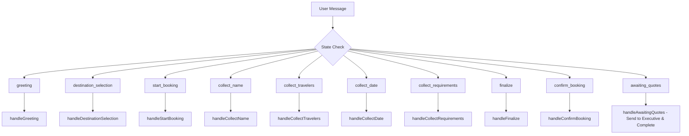

# WhatsApp Bot Conversation Flow

## Overview
The bot manages conversations through a state-based flow system in `botFlow.js`. Each user has a state that determines how their messages are processed. The flow guides users through selecting a travel package and completing a booking.

## Main States and Flow

## Detailed Flow Description

### 1. greeting
- **Handler**: `handleGreeting()`
- **Purpose**: Initial greeting and package introduction
- **Actions**:
  - Display available packages (London, NY, Paris, Santa)
  - Ask user to select a destination
- **Next State**: `destination_selection`

### 2. destination_selection
- **Handler**: `handleDestinationSelection()`
- **Purpose**: User selects travel package
- **Actions**:
  - Validate package choice
  - Store selected package in userData
  - Show package highlights and pricing
- **Next State**: `start_booking`

### 3. start_booking
- **Handler**: `handleStartBooking()`
- **Purpose**: Confirm interest in selected package
- **Actions**:
  - Show detailed package information
  - Handle questions using AI service
  - Ask if user wants to proceed with booking
- **Next State**: `collect_name` (if ready) or stay in state (if questions)

### 4. collect_name
- **Handler**: `handleCollectName()`
- **Purpose**: Collect user's full name
- **Actions**:
  - Validate name input (minimum 2 characters)
  - Store name in userData
- **Next State**: `collect_travelers`

### 5. collect_travelers
- **Handler**: `handleCollectTravelers()`
- **Purpose**: Collect number of travelers
- **Actions**:
  - Validate numeric input
  - Store number of travelers
- **Next State**: `collect_date`

### 6. collect_date
- **Handler**: `handleCollectDate()`
- **Purpose**: Collect preferred travel start date
- **Actions**:
  - Parse and validate date format (DD/MM/YYYY)
  - Check date is in future
  - Store date in userData
- **Next State**: `collect_requirements`

### 7. collect_requirements
- **Handler**: `handleCollectRequirements()`
- **Purpose**: Collect special requirements or preferences
- **Actions**:
  - Accept any text input
  - Store requirements
- **Next State**: `finalize`

### 8. finalize
- **Handler**: `handleFinalize()`
- **Purpose**: Show booking summary and prepare for confirmation
- **Actions**:
  - Display complete booking details
  - Send PDF brochure
  - Ask for final confirmation
- **Next State**: `confirm_booking`

### 9. confirm_booking
- **Handler**: `handleConfirmBooking()`
- **Purpose**: Final booking confirmation
- **Actions**:
  - Confirm booking
  - Send to executive notification
  - Generate request ID for quotes
- **Next State**: `awaiting_quotes`

### 10. awaiting_quotes
- **Handler**: `handleAwaitingQuotes()`
- **Purpose**: Wait for vendor quotes and complete booking process
- **Actions**:
  - Check for received quotes
  - Display available quotes when ready
  - Send booking details to executive notification
  - Complete the conversation
- **Next State**: End of flow

## Special Features

### AI Question Handling
- Available in `start_booking`, `awaiting_quotes` states
- Uses contextual AI responses for package-related questions
- Provides short, clear answers (1-2 sentences)

### Error Handling
- Invalid inputs return to same state with error message
- System errors provide fallback responses
- Connection issues trigger reconnection attempts

### Rate Limiting
- 5-second cooldown between messages per user
- Prevents rapid successive messages

### Concurrency Control
- One message processed per user at a time
- Queues additional messages

### PDF Sending
- Automatic PDF brochure delivery in `finalize` state
- Includes retry logic for connection failures
- Fallback to text summary if PDF fails

## Data Storage
- User states and data stored in memory with periodic cleanup
- Conversation history maintained (last 50 bot messages)
- Booking data persisted for quote matching

## Integration Points
- **AI Service**: Contextual responses and package information
- **Vendor System**: Quote requests and pricing
- **Executive Notifications**: Booking alerts and summaries
- **PDF Generation**: Brochure delivery
- **WhatsApp API**: Message sending via Baileys
